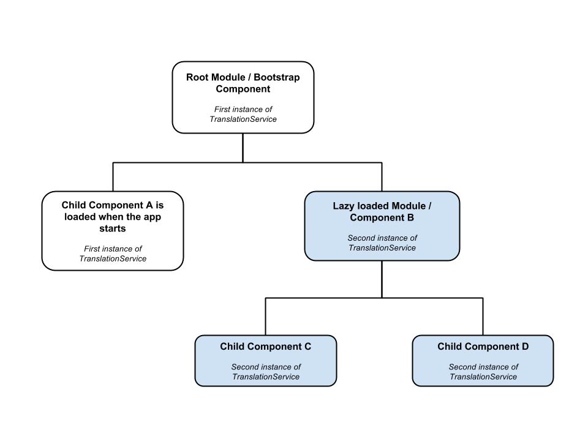

## Lazy loaded modules & Shared modules
Before you start using this configuration, you need to know how _lazy-loading_ works: [Lazy-loading modules with the router](https://angular.io/guide/ngmodule#lazy-loading-modules-with-the-router).

<br>

---

### Lazy loaded modules with the router
You can create an instance of `TranslationService` with its own translation data for every _lazy loaded_ module, as shown:


You can create a new instance of `TranslationService` calling the `forChild` method of the module you are using, 
and configure the service with the new providers:
```TypeScript
const l10nConfig: L10nConfig = {
    translation: {
        providers: [
            { type: ProviderType.Static, prefix: './src/assets/locale-' },
            { type: ProviderType.Static, prefix: './src/assets/locale-list-' }
        ],
        ...
    }
};

@NgModule({
    imports: [
        ...
        TranslationModule.forChild(l10nConfig) // New instance of TranslationService.
    ],
    declarations: [ListComponent]
})
export class ListModule {

    constructor(public l10nLoader: L10nLoader) {
        this.l10nLoader.load();
    }

}
```

> If you use a global file shared across _lazy loaded modules_, you can enable the `caching` during the configuration in `AppModule`.

In this way, application performance and memory usage are optimized.

<br>

---

### Shared modules
If you don't want a new instance of `TranslationService` with its own translation data for each feature module, but you want it to be _singleton_ and shared by other modules, you have to call `forRoot` method of the module you are using once in `AppModule`:
```TypeScript
@NgModule({
    imports: [
        ...
        SharedModule,
        TranslationModule.forRoot(l10nConfig)
    ],
    ...
})
export class AppModule { }
```
Import/export `TranslationModule` or `LocalizationModule` _without methods_ in a shared module: 
```TypeScript
const sharedModules: any[] = [
    ...
    TranslationModule
];

@NgModule({
    imports: sharedModules,
    exports: sharedModules
})

export class SharedModule { }
```
Then in the feature module (also if it is _lazy loaded_):
```TypeScript
@NgModule({
    imports: [
        ...
        SharedModule
    ],
    ...
})
export class ListModule { }
```
You must provide the configuration only in `AppModule`.
